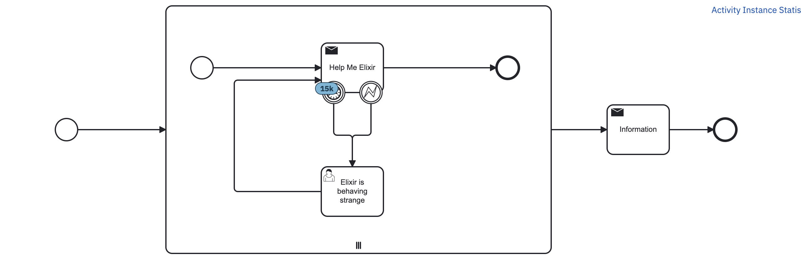
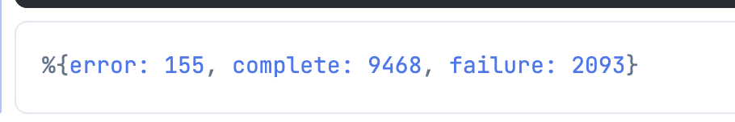
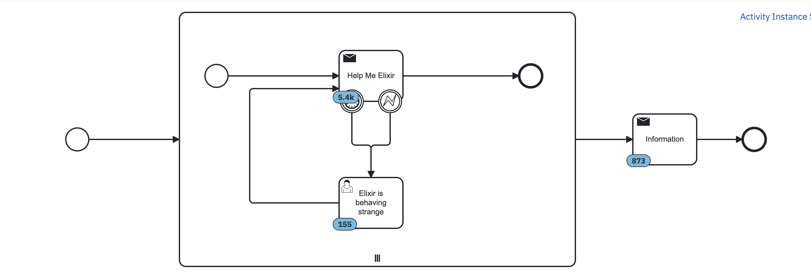

# BPMN Fun Demonstration

## Camunda Spring Boot

This is a simple process that will demonstrate how to use
Camunda External Task. The base application is a spring boot application.

You can start it locally with 

`./gradlew bootRun`

This will start up the application on localhost:8080. You can open
the camunda admin screen entering under [http://localhost:8080]().

User: demo
Password: demo

It has one process definition deployed.

## Elixir Livebook Demo

There is a livebook under [./bpmn.livemd](). Open it in a livebook
locally (download can be found under [https://livebook.dev/]()).

### Starting processes

There is a *Start Process* section. Inside it you can evaluate
the elixir code. It will start asynchronously some process
instances (5_000 by default, see variables at the top). Each
process instance has 3 dynamic chosen topics. In the Camunda
Admin for the only process definition, you can now see the instances
(15k instances, 5k processes, each with 3 subprocesses)

### External Tasks

Next section allows to handle external tasks. It will do different
actions based on a random chance. First it will fetch and lock
20k tasks maximal. Then it will asynchronously do one of 3 actions based on chance:

- 85% complete
- 1% error
- 14% failure

You can see below the executed cell how much landet where:

Looking at the camunda screen for the process instance again (need
to manually refresh the screen), we can see what happens:

- (BPMN) error: gets catched by the error boundary and is converted to a user task
- failure: marks a failure in the execution and allows a retry of the external task
  (for example by another worker)
- complete: will complete the process (no surprize)

If you let it run as is programmed here and observe the log you will
also see a ton of optimistic locking exceptions. This is one of the
disadvantages on how this processes are designed here: because they
are probably often getting the result at the same time, it will lead
to multiple responses wanting to update the same (parent) process.
Camunda will handle it correctly but you will have some additional
log messages (and naturally can change some of the flow).